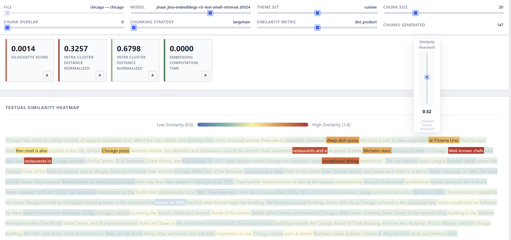
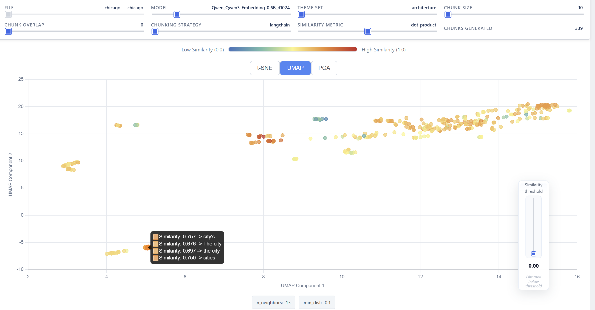

# ForzaEmbed: Benchmarking Framework for Text Embeddings

[](https://opensource.org/licenses/MIT)
[](https://www.python.org/downloads/)
[](https://berangerthomas.github.io/ForzaEmbed/)
[](https://huggingface.co/spaces/berangerthomas/forzaembeddemo)
[](https://github.com/berangerthomas/ForzaEmbed/releases)

ForzaEmbed is a Python framework for **benchmarking text embedding models** and processing strategies.

It runs a grid search over configurable hyperparameters (embedding model, chunking strategy, chunk size, similarity metric, etc.) and produces a **textual heatmap** highlighting theme-relevant text regions, alongside **t-SNE, UMAP, and PCA visualizations** to analyze embedding structure. The generated standalone HTML report is interactive: you can switch between projection methods, view text excerpts directly within scatter plot tooltips, and use a draggable floating vertical similarity-threshold slider; chunks and scatter points below the threshold are dimmed.

📖 **[Documentation](https://berangerthomas.github.io/ForzaEmbed/)** · 🚀 **[Live Demo](https://huggingface.co/spaces/berangerthomas/forzaembeddemo)** · 📦 **[Releases](https://github.com/berangerthomas/ForzaEmbed/releases)**

<!-- demo video -->
https://github.com/user-attachments/assets/3fe7b1a7-6dd8-42d2-9b13-800f19f1aa39

---

## How It Works

You drop your `.md` documents into `markdowns/`, define the parameter space in a YAML config file, and run `main.py`. ForzaEmbed then:

1. reads all documents from `markdowns/`;
2. expands the config into every combination of chunk size, overlap, chunking strategy, embedding model, and similarity metric;
3. for each combination: chunks the text, generates embeddings, and scores chunks against your defined themes;
4. evaluates each configuration using silhouette score (with intra/inter-cluster decomposition) and embedding computation time;
5. caches all results and embeddings in a SQLite database — completed combinations are skipped on subsequent runs;
6. generates a standalone interactive HTML report (heatmaps, t-SNE/UMAP/PCA visualizations with original text tooltips) in `reports/`. The report includes UI controls for selecting projection method, displaying relevant algorithm metadata, and a draggable floating similarity-threshold slider; chunks and scatter points below the threshold are dimmed.

> **Note on chunking strategies**: `langchain`, `raw`, and `semchunk` are parameter-sensitive (they use `chunk_size` and `chunk_overlap`). `nltk` and `spacy` are sentence-based and ignore those parameters — ForzaEmbed avoids generating redundant combinations for them, which can reduce the total number of runs by up to 40%.

---

## Project Structure

```
ForzaEmbed/
├── configs/          # YAML configuration files
├── docs/             # Documentation source (GitHub Pages)
├── markdowns/        # Source .md documents to analyse
├── reports/          # Generated reports and SQLite databases
├── src/              # Application source code
├── main.py           # Entry point
└── pyproject.toml    # Project metadata and dependencies
```

Each config run produces a dedicated database file: `reports/ForzaEmbed_<config_name>.db`.

---

## Getting Started

### 1. Installation

```bash
# Install uv (https://docs.astral.sh/uv/)
curl -LsSf https://astral.sh/uv/install.sh | sh
# On Windows: winget install --id=astral-sh.uv -e

# Clone and install
git clone https://github.com/berangerthomas/ForzaEmbed.git
cd ForzaEmbed
uv sync
```

### 2. Add your documents

Put your `.md` files into `markdowns/`.

### 3. Configure and run

Edit `configs/config.yml` (see [Configuration Guide](#configuration-guide) below), then:

```bash
python main.py --run --config-path configs/config.yml
```

To reproduce the Hugging Face demo page locally, run:

```bash
uv run .\main.py --run --config-path configs/chicago.yml
```

Use the supplied `configs/chicago.yml` and place the provided `chicago.md` file into the `markdowns/` directory before running.

---

## Command-Line Usage

### First run

```bash
python main.py --run --config-path configs/config.yml
```

Reads documents from `markdowns/`, runs the grid search, saves results to `reports/ForzaEmbed_config.db`, and generates `reports/config_index.html`.

### Resuming an interrupted run

Re-run the same command. Completed combinations are detected and skipped automatically.

### Regenerating reports only

To rebuild reports from existing database data (e.g. to change `--top-n`) without rerunning computations:

```bash
python main.py --generate-reports --config-path configs/config.yml
```

---

## Configuration Guide

Below is a minimal, annotated example configuration (based on `configs/chicago_demo_inf_10_Mo.yml`). The application validates YAML against the `AppConfig` Pydantic model found in `src/core/config.py`.

```yaml
grid_search_params:
  chunk_size: [10, 20, 50, 100, 250]
  chunk_overlap: [0, 5, 10, 25, 50]
  chunking_strategy: ["langchain", "raw", "semchunk", "nltk"]
  similarity_metrics: ["cosine", "euclidean", "dot_product"]
  themes:
    sports: ["ball", "team", "stadium", "game", "player"]
    architecture: ["building", "structure", "design", "bridge", "tower"]
    cuisine: ["food", "restaurant", "recipe", "chef", "taste"]

models_to_test:
  - type: "sentence_transformers"
    name: "Qwen/Qwen3-Embedding-0.6B"
    dimensions: 1024
    max_tokens: 32768
    pooling_strategy: "average"

generate_filtered_markdowns: false

database:
  intelligent_quantization: true

multiprocessing:
  embedding_batch_size_api: 100
  embedding_batch_size_local: 500
  api_batch_sizes:
    mistral: 50
    voyage: 100
    openai: 100
    default: 100
```

### Configuration Fields Explanation

- **`grid_search_params`**: Grid search parameter space.
  - **`chunk_size`**: List of candidate chunk sizes (in characters) used by `chunk_text()` (affects `langchain`, `raw`, `semchunk`).
  - **`chunk_overlap`**: List of overlap sizes (in characters) between consecutive chunks.
  - **`chunking_strategy`**: One or more of `langchain`, `raw`, `semchunk`, `nltk`, `spacy`. Note: `nltk` and `spacy` are sentence-based and ignore `chunk_size`/`chunk_overlap`.
  - **`similarity_metrics`**: Supported metrics are `cosine`, `dot_product`, `euclidean`, `manhattan`, `chebyshev`. Normalized limits are handled in `src/services/similarity_service.py`.
  - **`themes`**: Named sets of theme keywords used to compute similarity metrics against the document texts.

- **`models_to_test`**: List of embedding backend configurations to test. Fields:
  - **`type`**: `fastembed`, `huggingface`, `sentence_transformers`, or `api`.
  - **`name`**: The model's identifier/path, also used for caching.
  - **`dimensions`**: Embedding vector size.
  - **`base_url`** (optional): Needed for HTTP-based `api` providers.
  - **`timeout`** (optional): Timeout in seconds for `api` requests.
  - **`max_tokens`** (optional): Token limit for inference before intra-document fallback handling.
  - **`pooling_strategy`** (optional): `max`, `average`, `weighted`, or `last`.

- **`generate_filtered_markdowns`**: Legacy setting. Server-side filtered generation has been removed from `src/reporting/markdown_filter.py`. Use the client-side interactive sliders on the HTML report instead. Keep this as `false`.

- **`database`**:
  - **`intelligent_quantization`**: If enabled, reduces database footprint by quantizing values (e.g., embeddings normalized bounds to `float16`, explicit float similarities mapped to `uint16`). See `src/utils/database.py` details.
  - **`quantize_metrics`** (optional: defaults to `true`).

- **`multiprocessing`**: Tuning settings holding sensible defaults behind the scenes (`max_workers_api`, `file_batch_size`, etc.).
  - **`embedding_batch_size_api`** / **`embedding_batch_size_local`**: Inference processing batch limits.
  - **`api_batch_sizes`**: Adaptive limit based on provider names dynamically resolving from the model name (returns specific batches or `default`). Default overrides simplify YAML generation.

---

## Screenshots

### Textual similarity heatmap

<p align="center">
  
</p>

This view shows the textual similarity heatmap. Key points:

- **What it shows:** each highlighted span is a chunk; color encodes similarity to the selected theme (blue/green → low, yellow → mid, red → high). The color bar above the heatmap shows the mapping from similarity values to color.
- **Controls visible:** the top bar contains run parameters (model, `chunk_size`, `chunking_strategy`, similarity metric) and metric cards (silhouette score, intra/inter cluster distances, embedding computation time), which help compare runs.
- **Interaction:** the floating *similarity threshold* slider (right) dims chunks below the threshold so you can focus on the most relevant passages.
- **When to use:** inspect where theme-relevant phrases occur in a document, verify highlighting quality, and spot false positives or unexpected emphasis.

### UMAP projection (full width)

<p align="center">
  
</p>

This projection visualizes chunk embeddings in 2D using UMAP (points = chunks). Key points:

- **What it shows:** spatial clusters of semantically similar chunks; point color follows similarity to the selected theme (same color scale as the heatmap).
- **Controls visible:** projection selector (t-SNE / UMAP / PCA), similarity colorbar, and the similarity threshold slider. A tooltip displays the matched phrase and similarity value for individual points.
- **Interpretation tips:** nearby points are semantically related; dense red/orange regions identify clusters strongly associated with the theme; isolated points or mixed-color clusters highlight ambiguous chunks.

---

## License

MIT — see [LICENSE](LICENSE).
