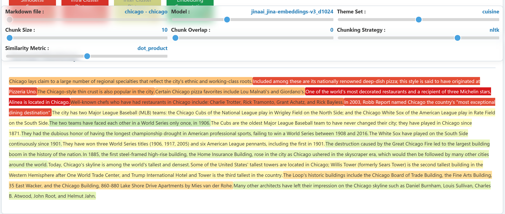

Quick Start Guide
=================

This guide will help you get started with ForzaEmbed in minutes.

Basic Workflow
--------------

ForzaEmbed follows a simple three-step workflow:

1. **Configure** your grid search parameters
2. **Run** the analysis
3. **Visualize** the results

Step 1: Prepare Your Data
--------------------------

Place your markdown files in a directory (e.g., ``markdowns/``)::

    markdowns/
    ├── document1.md
    ├── document2.md
    └── document3.md

Step 2: Create Configuration
-----------------------------

Create a YAML configuration file (e.g., ``configs/config.yml``):

.. code-block:: yaml

    # Grid search parameters
    grid_search_params:
      chunk_size: [100, 250, 500]
      chunk_overlap: [0, 10, 25]
      chunking_strategy: ["langchain", "semchunk"]
      similarity_metrics: ["cosine", "dot_product"]
      
      themes:
        schedule_keywords: [
          "opening hours",
          "schedule",
          "timetable"
        ]

    # Models to test
    models_to_test:
      - type: "fastembed"
        name: "BAAI/bge-small-en-v1.5"
        dimensions: 384
      
      - type: "sentence_transformers"
        name: "all-MiniLM-L6-v2"
        dimensions: 384

    # General settings
    output_dir: "reports"

    # Database settings
    database:
      intelligent_quantization: true

    # Performance settings
    multiprocessing:
      max_workers_api: 4
      max_workers_local: null
      embedding_batch_size_api: 100
      embedding_batch_size_local: 500

Step 3: Run the Analysis
-------------------------

Using Python API
~~~~~~~~~~~~~~~~

.. code-block:: python

    from src.core.core import ForzaEmbed

    # Initialize
    app = ForzaEmbed(
        db_path="reports/my_analysis.db",
        config_path="configs/config.yml"
    )

    # Run grid search
    app.run_grid_search(data_source="markdowns/")

    # Generate interactive HTML reports
    app.generate_reports(top_n=25)

Using Command Line
~~~~~~~~~~~~~~~~~~

::

    python main.py --config-path configs/config.yml --data-source markdowns/ --run

Generate reports only (after running analysis)::

    python main.py --config-path configs/config.yml --generate-reports --top-n 25

Step 4: Explore Results
-----------------------

After the analysis completes, you'll find:

1. **SQLite Database**: ``reports/my_analysis_ForzaEmbed.db``
   
   * Stores all embeddings, similarities, and metrics
   * Enables caching for subsequent runs

2. **Interactive HTML Report**: ``reports/my_analysis_index.html``
   
   * Textual heatmap showing similarity scores
   * Interactive controls to switch between configurations
   * T-SNE visualization of embedding clusters

3. **CSV Reports**: ``reports/similarity_report.csv``
   
   * Tabular comparison of all configurations
   * Metrics for each combination

Understanding the Heatmap
--------------------------

The textual heatmap is the key visualization in ForzaEmbed:

* **Red text**: High similarity with theme keywords (relevant chunks)
* **Blue text**: Low similarity (less relevant chunks)
* **Interactive sliders**: Change model, chunk size, and other parameters in real-time
* **Hover tooltips**: See exact similarity scores

Example Output
--------------

Next Steps
----------

* Learn about :doc:`configuration` options
* Explore :doc:`examples` for common use cases
* Check the :doc:`api/core` for advanced usage
